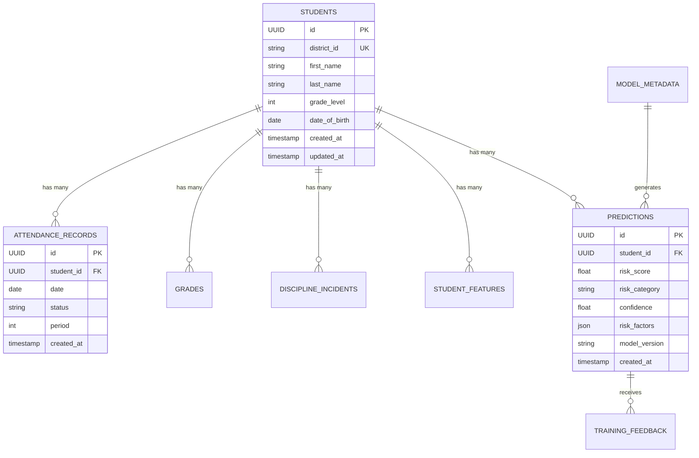

# Database Schema Documentation

> **Last Updated**: 2025-08-13 02:56:19 CDT  
> **Schema Version**: v1.0  
> **Database**: PostgreSQL 13+ (Production), SQLite (Testing)

## Overview

EduPulse uses a relational database schema designed for efficient storage and retrieval of student academic and behavioral data. The schema supports temporal data analysis, ML feature extraction, and audit trails.

## Architecture Principles

- **Temporal Design**: All records include timestamps and support historical analysis
- **Referential Integrity**: Foreign key constraints ensure data consistency
- **Scalability**: Indexed columns and optimized relationships for large datasets
- **Audit Trail**: Complete history of predictions and student record changes
- **Cross-Database Compatibility**: Supports both PostgreSQL (production) and SQLite (testing)

---

## Core Tables

### Students

Central table containing student demographic and enrollment information.

```sql
CREATE TABLE students (
    id UUID PRIMARY KEY DEFAULT uuid_generate_v4(),
    district_id VARCHAR(50) UNIQUE NOT NULL,
    first_name VARCHAR(100) NOT NULL,
    last_name VARCHAR(100) NOT NULL,
    grade_level INTEGER CHECK (grade_level >= 0 AND grade_level <= 12),
    date_of_birth DATE NOT NULL,
    gender VARCHAR(10),
    ethnicity VARCHAR(100),
    socioeconomic_status VARCHAR(50),
    gpa REAL CHECK (gpa >= 0 AND gpa <= 4.0),
    attendance_rate REAL CHECK (attendance_rate >= 0 AND attendance_rate <= 1.0),
    parent_contact VARCHAR(200),
    enrollment_date DATE DEFAULT CURRENT_DATE,
    student_metadata JSONB DEFAULT '{}',
    created_at TIMESTAMPTZ DEFAULT NOW(),
    updated_at TIMESTAMPTZ DEFAULT NOW()
);

-- Indexes for performance
CREATE INDEX idx_students_district_id ON students(district_id);
CREATE INDEX idx_students_grade_level ON students(grade_level);
CREATE INDEX idx_students_enrollment_date ON students(enrollment_date);
CREATE INDEX idx_students_created_at ON students(created_at);
```

**Key Fields:**
- `id`: System-generated UUID primary key
- `district_id`: School district student identifier (unique, external key)
- `grade_level`: Current grade (0-12, supports K=0)
- `student_metadata`: Flexible JSON storage for additional data
- Demographic fields support equity analysis and intervention targeting

**Relationships:**
- One-to-many with attendance_records, grades, discipline_incidents
- One-to-many with predictions and student_features

---

## Historical Data Tables

### Attendance Records

Daily attendance tracking with period-level granularity.

```sql
CREATE TABLE attendance_records (
    id UUID PRIMARY KEY DEFAULT uuid_generate_v4(),
    student_id UUID REFERENCES students(id) ON DELETE CASCADE,
    date DATE NOT NULL,
    status VARCHAR(20) CHECK (status IN ('present', 'absent', 'tardy', 'excused')),
    period INTEGER,
    created_at TIMESTAMPTZ DEFAULT NOW(),
    
    UNIQUE(student_id, date, period)
);

-- Indexes for temporal queries
CREATE INDEX idx_attendance_student_date ON attendance_records(student_id, date);
CREATE INDEX idx_attendance_date_status ON attendance_records(date, status);
CREATE INDEX idx_attendance_status ON attendance_records(status);
```

**Business Rules:**
- Multiple records per student per day (different periods)
- Unique constraint prevents duplicate entries
- Status values align with school district standards
- Period can be NULL for schools without period tracking

### Grades

Academic performance records with assignment-level detail.

```sql
CREATE TABLE grades (
    id UUID PRIMARY KEY DEFAULT uuid_generate_v4(),
    student_id UUID REFERENCES students(id) ON DELETE CASCADE,
    course_id VARCHAR(50) NOT NULL,
    course_name VARCHAR(200),
    grade_value REAL CHECK (grade_value >= 0 AND grade_value <= 100),
    grade_letter VARCHAR(2),
    submission_date DATE NOT NULL,
    assignment_type VARCHAR(50),
    created_at TIMESTAMPTZ DEFAULT NOW()
);

-- Indexes for academic analysis
CREATE INDEX idx_grades_student_course ON grades(student_id, course_id);
CREATE INDEX idx_grades_submission_date ON grades(submission_date);
CREATE INDEX idx_grades_course_id ON grades(course_id);
CREATE INDEX idx_grades_assignment_type ON grades(assignment_type);
```

**Key Features:**
- Supports both numerical (0-100) and letter grades
- Course tracking for subject-specific analysis
- Assignment type categorization (test, homework, project, etc.)
- Temporal analysis for grade trends

### Discipline Incidents

Behavioral incident tracking with severity classification.

```sql
CREATE TABLE discipline_incidents (
    id UUID PRIMARY KEY DEFAULT uuid_generate_v4(),
    student_id UUID REFERENCES students(id) ON DELETE CASCADE,
    incident_date DATE NOT NULL,
    severity_level INTEGER CHECK (severity_level >= 1 AND severity_level <= 5),
    incident_type VARCHAR(100),
    description TEXT,
    resolution VARCHAR(200),
    created_at TIMESTAMPTZ DEFAULT NOW()
);

-- Indexes for behavioral analysis
CREATE INDEX idx_discipline_student_date ON discipline_incidents(student_id, incident_date);
CREATE INDEX idx_discipline_severity ON discipline_incidents(severity_level);
CREATE INDEX idx_discipline_type ON discipline_incidents(incident_type);
```

**Severity Levels:**
1. Minor (tardy, dress code)
2. Moderate (disruption, inappropriate language)
3. Serious (defiance, fighting)
4. Major (weapons, drugs)
5. Critical (violence, safety threats)

---

## ML and Analytics Tables

### Student Features

Processed feature vectors for ML model input, calculated weekly.

```sql
CREATE TABLE student_features (
    student_id UUID REFERENCES students(id) ON DELETE CASCADE,
    feature_date DATE NOT NULL,
    attendance_rate REAL CHECK (attendance_rate >= 0 AND attendance_rate <= 1),
    gpa_current REAL CHECK (gpa_current >= 0 AND gpa_current <= 5),
    discipline_incidents INTEGER CHECK (discipline_incidents >= 0) DEFAULT 0,
    feature_vector JSONB,  -- Serialized feature array for ML model
    created_at TIMESTAMPTZ DEFAULT NOW(),
    
    PRIMARY KEY (student_id, feature_date),
    UNIQUE(student_id, feature_date)
);

-- Indexes for feature retrieval
CREATE INDEX idx_features_date ON student_features(feature_date);
CREATE INDEX idx_features_student_date ON student_features(student_id, feature_date);
```

**Feature Vector Structure:**
```json
{
  "attendance": [0.85, 0.90, 0.82, 0.88],    // 4-week rolling attendance
  "academic": [3.2, 2.8, 3.0, 2.9],          // 4-week rolling GPA
  "behavioral": [0, 1, 0, 2],                 // Weekly discipline incidents
  "trends": [0.02, -0.15, 0.03],             // Slope indicators
  "metadata": {
    "weeks_of_data": 20,
    "data_quality": 0.95
  }
}
```

### Predictions

ML model predictions with interpretability data.

```sql
CREATE TABLE predictions (
    id UUID PRIMARY KEY DEFAULT uuid_generate_v4(),
    student_id UUID REFERENCES students(id) ON DELETE CASCADE,
    prediction_date TIMESTAMPTZ DEFAULT NOW(),
    risk_score REAL CHECK (risk_score >= 0 AND risk_score <= 1),
    risk_category VARCHAR(20) CHECK (risk_category IN ('low', 'medium', 'high', 'critical')),
    confidence REAL CHECK (confidence >= 0 AND confidence <= 1),
    risk_factors JSONB DEFAULT '[]',
    model_version VARCHAR(50),
    created_at TIMESTAMPTZ DEFAULT NOW()
);

-- Indexes for prediction analysis
CREATE INDEX idx_predictions_student ON predictions(student_id);
CREATE INDEX idx_predictions_date ON predictions(prediction_date);
CREATE INDEX idx_predictions_risk_category ON predictions(risk_category);
CREATE INDEX idx_predictions_model_version ON predictions(model_version);
```

**Risk Factors JSON Structure:**
```json
[
  {
    "factor": "attendance_rate_30d",
    "weight": 0.34,
    "value": 0.65,
    "description": "Low attendance pattern detected",
    "recommendation": "Contact family to discuss attendance barriers"
  },
  {
    "factor": "gpa_decline",
    "weight": 0.28,
    "value": -0.8,
    "description": "Significant GPA decline over 6 months",
    "recommendation": "Academic support and tutoring intervention"
  }
]
```

### Training Feedback

Human feedback for model improvement and validation.

```sql
CREATE TABLE training_feedback (
    id UUID PRIMARY KEY DEFAULT uuid_generate_v4(),
    prediction_id UUID REFERENCES predictions(id) ON DELETE CASCADE,
    outcome_date DATE,
    outcome_type VARCHAR(50),
    feedback_type VARCHAR(50) CHECK (
        feedback_type IN ('true_positive', 'false_positive', 'true_negative', 'false_negative')
    ),
    educator_notes TEXT,
    created_at TIMESTAMPTZ DEFAULT NOW()
);

-- Indexes for training analysis
CREATE INDEX idx_feedback_prediction ON training_feedback(prediction_id);
CREATE INDEX idx_feedback_type ON training_feedback(feedback_type);
CREATE INDEX idx_feedback_outcome_date ON training_feedback(outcome_date);
```

---

## Model Management Tables

### Model Metadata

Version control and performance tracking for ML models.

```sql
CREATE TABLE model_metadata (
    id UUID PRIMARY KEY DEFAULT uuid_generate_v4(),
    model_version VARCHAR(50) UNIQUE NOT NULL,
    model_type VARCHAR(50),
    training_date TIMESTAMPTZ DEFAULT NOW(),
    performance_metrics JSONB DEFAULT '{}',
    hyperparameters JSONB DEFAULT '{}',
    is_active BOOLEAN DEFAULT FALSE,
    created_at TIMESTAMPTZ DEFAULT NOW()
);

-- Indexes for model management
CREATE INDEX idx_model_version ON model_metadata(model_version);
CREATE INDEX idx_model_active ON model_metadata(is_active);
CREATE INDEX idx_model_training_date ON model_metadata(training_date);
```

**Performance Metrics Example:**
```json
{
  "accuracy": 0.89,
  "precision": 0.87,
  "recall": 0.91,
  "f1_score": 0.89,
  "auc_roc": 0.92,
  "precision_at_k": {
    "k5": 0.94,
    "k10": 0.91,
    "k20": 0.88
  },
  "validation_loss": 0.234,
  "training_samples": 15000,
  "validation_samples": 3000
}
```

---

## Cross-Database Compatibility

### UUID Implementation

**PostgreSQL (Production):**
```sql
-- Uses native UUID type with uuid_generate_v4()
CREATE EXTENSION IF NOT EXISTS "uuid-ossp";
id UUID PRIMARY KEY DEFAULT uuid_generate_v4()
```

**SQLite (Testing):**
```python
# Custom GUID TypeDecorator in SQLAlchemy
class GUID(TypeDecorator):
    impl = CHAR
    def load_dialect_impl(self, dialect):
        if dialect.name == 'postgresql':
            return dialect.type_descriptor(UUID())
        else:
            return dialect.type_descriptor(CHAR(32))
```

### JSON Storage

**PostgreSQL:** Uses `JSONB` for efficient JSON operations and indexing
**SQLite:** Uses `JSON` with text storage (no binary optimization)

### Constraints and Indexes

All constraints and indexes are compatible across both databases with appropriate SQLAlchemy abstractions.

---

## Data Relationships



---

## Query Patterns

### Common Analytics Queries

**Student Risk Assessment:**
```sql
-- Get current risk for all high-risk students
SELECT s.district_id, s.first_name, s.last_name, s.grade_level,
       p.risk_score, p.risk_category, p.prediction_date
FROM students s
JOIN predictions p ON s.id = p.student_id
WHERE p.id = (
    SELECT id FROM predictions p2 
    WHERE p2.student_id = s.id 
    ORDER BY prediction_date DESC 
    LIMIT 1
) AND p.risk_category IN ('high', 'critical')
ORDER BY p.risk_score DESC;
```

**Attendance Trends:**
```sql
-- Weekly attendance rates by grade level
SELECT s.grade_level,
       DATE_TRUNC('week', ar.date) as week,
       COUNT(*) as total_records,
       COUNT(CASE WHEN ar.status = 'present' THEN 1 END) as present_count,
       ROUND(
         COUNT(CASE WHEN ar.status = 'present' THEN 1 END)::numeric / 
         COUNT(*)::numeric, 3
       ) as attendance_rate
FROM students s
JOIN attendance_records ar ON s.id = ar.student_id
WHERE ar.date >= CURRENT_DATE - INTERVAL '8 weeks'
GROUP BY s.grade_level, DATE_TRUNC('week', ar.date)
ORDER BY week, s.grade_level;
```

**Model Performance Analysis:**
```sql
-- Prediction accuracy analysis
SELECT mm.model_version,
       tf.feedback_type,
       COUNT(*) as feedback_count,
       ROUND(AVG(p.risk_score), 3) as avg_predicted_risk,
       ROUND(AVG(p.confidence), 3) as avg_confidence
FROM predictions p
JOIN training_feedback tf ON p.id = tf.prediction_id
JOIN model_metadata mm ON p.model_version = mm.model_version
WHERE tf.created_at >= CURRENT_DATE - INTERVAL '30 days'
GROUP BY mm.model_version, tf.feedback_type
ORDER BY mm.model_version, tf.feedback_type;
```

---

## Performance Considerations

### Indexing Strategy

1. **Primary Keys**: All tables use UUID primary keys with automatic indexing
2. **Foreign Keys**: Indexed for join performance and referential integrity
3. **Temporal Queries**: Date columns indexed for time-series analysis
4. **Categorical Filters**: Status and category fields indexed for filtering
5. **Composite Indexes**: Multi-column indexes for common query patterns

### Partitioning (PostgreSQL)

For high-volume environments, consider partitioning by date:

```sql
-- Partition attendance_records by month
CREATE TABLE attendance_records_2025_01 PARTITION OF attendance_records
FOR VALUES FROM ('2025-01-01') TO ('2025-02-01');
```

### Maintenance

```sql
-- Regular maintenance tasks
REINDEX TABLE students;
ANALYZE students;
VACUUM ANALYZE attendance_records;

-- Monitor table sizes
SELECT schemaname, tablename, 
       pg_size_pretty(pg_total_relation_size(schemaname||'.'||tablename)) as size
FROM pg_tables 
WHERE schemaname = 'public'
ORDER BY pg_total_relation_size(schemaname||'.'||tablename) DESC;
```

---

## Security and Privacy

### Data Protection

- **PII Handling**: Student names and contact info require special handling
- **Audit Logging**: All data modifications logged with timestamps
- **Access Controls**: Row-level security for multi-tenant deployments
- **Encryption**: Database encryption at rest and in transit

### Compliance Considerations

- **FERPA**: Educational records protection requirements
- **State Privacy Laws**: Student data privacy compliance
- **Data Retention**: Configurable retention policies for historical data
- **Anonymization**: Support for anonymizing data for research

---

## Migration and Versioning

### Schema Migrations

Migrations handled through SQLAlchemy Alembic:

```python
# Example migration
def upgrade():
    op.add_column('students', 
                  sa.Column('last_login', sa.DateTime(timezone=True)))
    op.create_index('idx_students_last_login', 'students', ['last_login'])

def downgrade():
    op.drop_index('idx_students_last_login')
    op.drop_column('students', 'last_login')
```

### Version History

| Version | Date | Changes |
|---------|------|---------|
| v1.0 | 2025-08-13 | Initial schema with core tables |
| v0.9 | 2025-08-01 | Added training feedback table |
| v0.8 | 2025-07-15 | Implemented cross-database compatibility |

---

## Backup and Recovery

### Backup Strategy

```bash
# PostgreSQL backup
pg_dump -h localhost -U edupulse_user -d edupulse > edupulse_backup.sql

# Point-in-time recovery setup
# Enable WAL archiving in postgresql.conf
archive_mode = on
archive_command = 'cp %p /backup/archive/%f'
```

### Disaster Recovery

- **Daily Backups**: Automated full database backups
- **WAL Archiving**: Continuous point-in-time recovery capability
- **Replication**: Hot standby for high availability
- **Testing**: Regular recovery drills and backup validation

---

## Development and Testing

### Test Data Generation

```python
# Generate realistic test data
from src.tests.conftest import batch_students

def create_test_data(db_session, num_students=100):
    """Create comprehensive test dataset."""
    students = batch_students(db_session, count=num_students)
    
    for student in students:
        # Generate 90 days of attendance
        create_attendance_records(student, days=90)
        
        # Generate grades for 4 courses
        create_grade_records(student, courses=4, assignments=20)
        
        # Generate occasional discipline incidents
        if random.random() < 0.3:  # 30% of students
            create_discipline_incidents(student, count=random.randint(1, 3))
```

### Database Testing

Tests use SQLite for speed and isolation:

```python
# Test database configuration
TEST_DATABASE_URL = "sqlite:///:memory:"
engine = create_engine(TEST_DATABASE_URL)
Base.metadata.create_all(bind=engine)
```

---

This schema documentation provides the foundation for understanding EduPulse's data architecture and supports developers, data analysts, and system administrators in working with the system effectively.